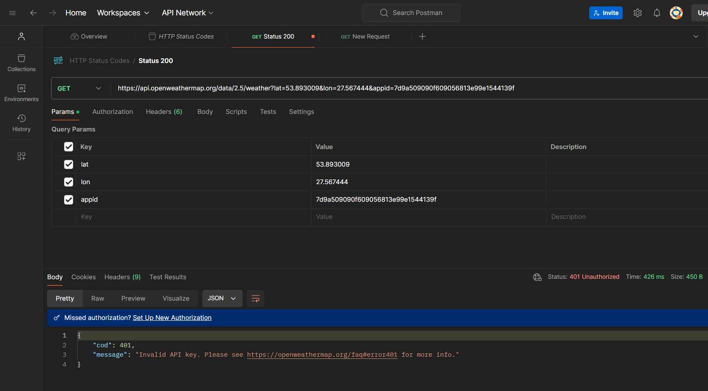
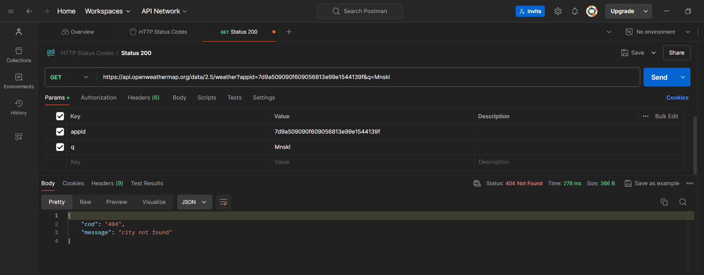
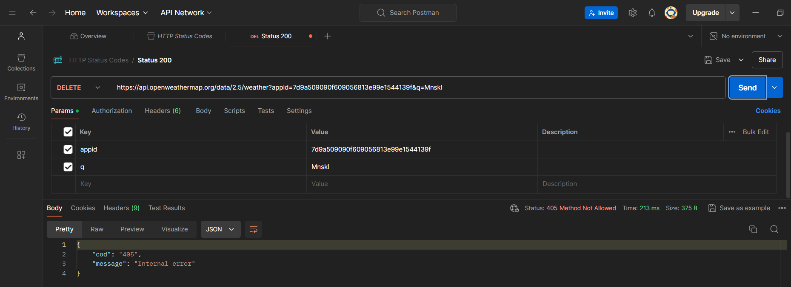

## 200 ok

*Запрос был успешным, и сервер вернул запрашиваемые данные.*
## 400 bad request

*Неверный синтаксис запроса(отсутствует обязательный параметр q).* 
## 401 unauthorized

*Ошибка аутентификации(некорректный API ключ).*
## 404 not found

*Ресурс не найден(Несуществующий город).*
## 405 method not allowed

*Метод запроса известен серверу, но не поддерживается целевым ресурсом.*
